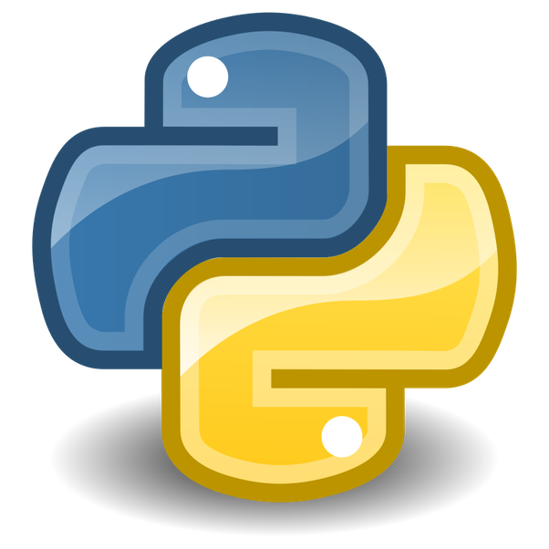

# Bem vindo ao meu aprendizado em Python 

**Neste curso eu vou dominar todo o python do básico ao avançado, e mostrarei o meu progresso.**

- [X] Vontade de aprender
- [ ] Novas Oportunidade
- [X] Python

## Módulos em Falta
Propriedade | Descrição
----------- | -----------
Introdução a POO | Classes e outra finalidades
Módulos Python | os,sys,json,csv,selenium
PySide6 | Interface gráfica
Base de Dados | Sqlite3 e MySQL
